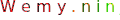

# Trackmania How to's

> Everything I do here is for Trackmania² Stadium, but it's pretty much the same for every Trackmania.

  

## Server :
- [TM² Dedicated Server on Debian 9 + pyplanet or uaseco](Server/Trackmania²-Dedicated-Server.md)
- https://github.com/Vincent-HD/Trackmania2020-dedicated-docker

---

## Skin :
- [Make you own 2D Skin](Skin/Make%20you%20own%202D%20Skin.md)
- [Make you own 3D Model](Skin/Make%20you%20own%203D%20Model.md)

---

## Mapping
- [Import you own 3D Model](Mapping/Import%20you%20own%203D%20Model.md)
- [[Tutorial] How to embed objects ](https://tm.mania-exchange.com/threads/2684/tutorial-how-to-embed-objects?page=1)

---

## Scripting
- [ManiaScript](Scripting/ManiaScript.md)

---

## Usefull links
- Maniaplanet : [Documentation](https://doc.maniaplanet.com/)  /  [Forum](https://forum.maniaplanet.com/index.php)  /  [Maniastars](https://www.maniaplanet.com/account/maniastars)  /  [Retrieve validation code](https://www.maniaplanet.com/account/validation-code)
- [ManiaExchange](https://tm.mania-exchange.com/)
- [Maniapark](http://www.maniapark.com)
- [PyPlanet Documentation](https://pypla.net/en/latest/)
- [Dedimania](http://dedimania.net/tm2stats/?do=stat)  / [dedimania forum](http://dedimania.net/SITE/forum/)
- [OpenPlanet](https://openplanet.nl/)
- https://donadigo.com/tminterface/

---

## Tips'n Tricks

- Maniaplanet Protocol ([Doc](https://doc.maniaplanet.com/client/maniaplanet-protocol))
    - Direct url to server : 
        - `maniaplanet://#join=SERVERLOGIN` or 
        - `maniaplanet://#join=SERVERLOGIN@TMStadium@nadeo`
    - Direct url to a specific campaign map :
        - A08 for exemple : `maniaplanet://#campaign=#1,8@TMStadium@nadeo` \
        The first number is the group and the second number is the map. \
        `1` for the White series (A0x), `2` for Green (B0x), `3` for Blue C0x), `4` for Red (D0x) and `5` for Black (E0x)
        - `$h[maniaplanet://#campaign=#1,8@TMStadium@nadeo]A08` 
- Clickable external link in chat : put `$L`in front of the link.
    - Ex: `$Lhttps://exemple.com`
- Clickable internal link in chat : put `$h`in front.
    - Ex: `$hmaniaplanet://#campaign=#1,8@TMStadium@nadeo`
- Clickable custom external link : `$L[url]text`

---

## In-game

    
Text formatting

   
    
  [Link to Doc](https://doc.maniaplanet.com/client/text-formatting)
  
  | Control character |  	Formatting| 
  |---|---|
  | $w | Wide |
  | $n | Narrow |
  | $o | **Bold** |
  | $i | *Italic* |
  | $t | Uppercase |
  | $s | Drop shadow |
  | $g | Reset to default color |
  | $z | Reset to default text style |
  | $$ | Display a $ character |
  | $l | External link |  
  | $h | Manialink |
    

    
Colored text or nick

   
    
  [Link to doc](https://doc.maniaplanet.com/client/text-formatting)
  
  To use colors you need to put the `$` sign in front of your text followed by the 3-character hexadecimal code of the desired colour:
  - Each 3 characters can have 16 values from 0 to f (`0123456789abcdef`).
  - The first character is for the red colour pallet, 2nd is for green and 3rd for blue.
  
  Exemple: `$F00Wemy.$F80n$FA0i$FC0n$FD0j$FF0a` \
  will give : 
    
  

  
  Here's a few exemples of color core :
  
  

  
   see the manialinks right below for more customization

    
Useful Manialinks

 
    
**`nickedit`** : help you create customized nick directly in-game \
    

    
**`symbols`** : symbols you can use in chat or in your nick \
    

    

    
Custom Avatar (image or GIF)

     

    
WIP  
Location (on Windows) : `%USERPROFILE%\Documents\Maniaplanet\Skins\Avatars`

    

---

## Guide

- [[E-sports] A Guide to competitive TrackMania](https://steamcommunity.com/sharedfiles/filedetails/?id=251608621)
- [FR] [Le Neo drift et le Speed Drift dans Trackmania](https://www.mandatory.gg/trackmania/guides-trackmania/trackmania-neodrift-et-speed-drift/)

