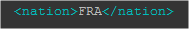

<p align="center"></p>

# How to setup a Dedicated server for Trackmania² Stadium on Debian 9 and a server controller ([Pyplanet](https://pypla.net/en/latest/) or [uaseco](https://www.uaseco.org/))

This page is also available on my blog : https://ais.wemy.ninja/Trackmania²-Dedicated-Server/

---

Skip directly to [Uaseco](#UASECO) \
Skip directly to [PyPlanet](#PyPlanet)

---

## Downloading the Server Files

Downloading and unziping the latest [Maniaplanet Dedicated server](http://files.v04.maniaplanet.com/server/ManiaplanetServer_Latest.zip) in the home directory of a dedicated user: `tm`

```bash
adduser tm
su tm
cd /home/tm/
wget http://files.v04.maniaplanet.com/server/ManiaplanetServer_Latest.zip
unzip ManiaplanetServer_Latest.zip -d TM2Server
cd TM2Server
```

Downloading the [`TMStadium@nadeo`](https://maniaplanet.com/ingame/public/titles/download/TMStadium@nadeo.Title.Pack.gbx) pack in the `Packs` directory

```bash
cd Packs
wget https://maniaplanet.com/ingame/public/titles/download/TMStadium@nadeo.Title.Pack.gbx
```

---

## Editing the DedicatedConfig file

Before editing the file, head over to your maniaplanet account and create a dedicated Server Account  
[https://www.maniaplanet.com/account/dedicated-servers](https://www.maniaplanet.com/account/dedicated-servers)

Choose a `Login`, `Password`, `Zone` Then `Create`

<p align="center"></p>

Now edit the `dedicated_cfg`

```bash
cd /home/tm/TM2Server/UserData/Config
cp dedicated_cfg.default.txt dedicated_cfg.txt
nano dedicated_cfg.txt
```

Under `<authorization_levels>`, change the passwords for `SuperAdmin`, `Admin`, and `User`

<p align="center"></p>

Under `<masterserver_account>`, enter the login and password of the server account previously created. \
If you want to enable Planets transactions on your server, fill in the `<validation_key>`. \
> If you don’t remember it, you can retrieve or get a new one here (you will need you game key)\
> [https://www.maniaplanet.com/account/validation-code](https://www.maniaplanet.com/account/validation-code)

<p align="center"></p>

Under `<server_options>`, change the `name` and `max_players`

<p align="center"></p>

If you want to give your server a nice looking name with some colors, you need put a color code before each letter or words

<p align="center"></p>

Exemple (remove the space between the codes and letters): \
`$F00 Wemy. $F80 n $FA0 i $FC0 n $FD0 j $FF0 a` \
will give : 
<span style="color:#ff0d11">W</span><span style="color:#ff373a">e</span><span style="color:#ff0307">m</span><span style="color:#ff1a1e">y</span><span style="color:#ff5300">.</span><span style="color:#ff5300">n</span><span style="color:#ff8a00">i</span><span style="color:#ffd000">n</span><span style="color:#ffe500">j</span><span style="color:#ffff51">a</span> (github doesn't show the colors)

Or if you don't want to do it manually, you can use one easy to use manialink directly ingame:

Top left corner, click on the compass and search : `nickedit` \

<br>

Back to the dedicated_cfg \
Under `<system_config>`, change the `title` to `TMStadium`

<p align="center"></p>

Save and Quit.

Here what the final file looks like: 

```xml
<?xml version="1.0" encoding="utf-8" ?>

<dedicated>
        <authorization_levels>
                <level>
                        <name>SuperAdmin</name>
                        <password>********</password>
                </level>
                <level>
                        <name>Admin</name>
                        <password>********</password>
                </level>
                <level>
                        <name>User</name>
                        <password>********</password>
                </level>
        </authorization_levels>

        <masterserver_account>
                <login>pgnaim_S</login>
                <password>********</password>
                <validation_key>*****</validation_key>
        </masterserver_account>

        <server_options>
                <name>$FC3Yes Another Shitty Server</name>
                <comment></comment>
                <hide_server>0</hide_server>                                    <!-- value is 0 (always shown), 1 (always hidden), 2 (hidden from nations) -->

                <max_players>16</max_players>
                <password></password>

                <max_spectators>32</max_spectators>
                <password_spectator></password_spectator>

                <keep_player_slots>False</keep_player_slots>                    <!-- when a player changes to spectator, hould the server keep if player slots/scores etc.. or not. -->
                <ladder_mode>forced</ladder_mode>                               <!-- value between 'inactive', 'forced' (or '0', '1') -->

                <enable_p2p_upload>True</enable_p2p_upload>
                <enable_p2p_download>False</enable_p2p_download>

                <callvote_timeout>60000</callvote_timeout>
                <callvote_ratio>0.5</callvote_ratio>                            <!-- default ratio. value in [0..1], or -1 to forbid. -->
                <callvote_ratios>
                        <voteratio command="Ban" ratio="-1"/>
                        <!-- commands can be "Ban", "Kick", "RestartMap", "NextMap", "SetModeScriptSettingsAndCommands"... -->
                </callvote_ratios>

                <allow_map_download>True</allow_map_download>
                <autosave_replays>False</autosave_replays>
                <autosave_validation_replays>False</autosave_validation_replays>

                <referee_password></referee_password>
                <referee_validation_mode>0</referee_validation_mode>            <!-- value is 0 (only validate top3 players),  1 (validate all players) -->

                <use_changing_validation_seed>False</use_changing_validation_seed>

                <disable_horns>False</disable_horns>
                <clientinputs_maxlatency>0</clientinputs_maxlatency>            <!-- 0 mean automatic adjustement -->
        </server_options>

        <system_config>
                <connection_uploadrate>8000</connection_uploadrate>             <!-- Kbits per second -->
                <connection_downloadrate>8000</connection_downloadrate>         <!-- Kbits per second -->
                <packetassembly_threadcount>1</packetassembly_threadcount>     <!-- Number of threads used when assembling packets. Defaults to 1. -->

                <allow_spectator_relays>False</allow_spectator_relays>

                <p2p_cache_size>600</p2p_cache_size>

                <force_ip_address></force_ip_address>
                <server_port>2350</server_port>
                <server_p2p_port>3450</server_p2p_port>
                <client_port>0</client_port>
                <bind_ip_address></bind_ip_address>

                <gsp_name></gsp_name>                                           <!-- Game Server Provider name and info url -->
                <gsp_url></gsp_url>                                             <!-- If you're a server hoster, you can use this to advertise your services -->

                <xmlrpc_port>5000</xmlrpc_port>
                <xmlrpc_allowremote>False</xmlrpc_allowremote>                  <!-- If you specify an ip adress here, it'll be the only accepted adress. this will improve security. -->

                <scriptcloud_source>nadeocloud</scriptcloud_source>             <!-- Specify the cloud storage mode for Titles that use it. Can be "localdebug" or "xmlrpc" or "nadeocloud" (defa$


                <blacklist_url></blacklist_url>
                <guestlist_filename></guestlist_filename>
                <blacklist_filename></blacklist_filename>

                <title>TMStadium</title>                <!-- SMStorm, TMCanyon, ... -->

                <minimum_client_build></minimum_client_build>                   <!-- Only accept updated client to a specific version. ex: 2011-10-06 -->

                <disable_coherence_checks>False</disable_coherence_checks>      <!-- disable internal checks to detect issues/cheats, and reject race times -->

                <disable_replay_recording>False</disable_replay_recording>      <!-- disable replay recording in memory during the game to lower memory usage. -->
                <save_all_individual_runs>False</save_all_individual_runs>      <!-- Save all the ghosts from the match replay to individual ghost.gbx files, in folder {servername}/Autosaves/Ru$

                <use_proxy>False</use_proxy>
                <proxy_url></proxy_url>
        </system_config>
</dedicated>

```

  
These are the bare minimum settings you need to change.

<br>

---

## MatchSettings File

Back to the root directory of your server to generate all the required files and folder by launching the server and stoping it.

```bash
cd /home/tm/TM2Server
./ManiaPlanetServer
```

Then <kbd>Ctrl + C</kbd> to stop the server

Go the the config helper page to generate the MatchSettings \
https://www.maniaplanet.com/account/dedicated-servers/helper

```bash
nano /home/tm/TM2Server/UserData/Maps/MatchSettings/YASS.txt
```

```xml
<?xml version="1.0" encoding="UTF-8"?>

<playlist> 
    <gameinfos>
        <game_mode>0</game_mode>
        <chat_time>10000</chat_time>
        <finishtimeout>1</finishtimeout>
        <allwarmupduration>0</allwarmupduration>
        <disablerespawn>0</disablerespawn>
        <forceshowallopponents>0</forceshowallopponents>
        <script_name><![CDATA[TimeAttack.Script.txt]]></script_name>
        <title>TMStadium@nadeo</title>
    </gameinfos>
        
    <filter> 
        <is_lan>1</is_lan>
        <is_internet>1</is_internet>
        <is_solo>0</is_solo>
        <is_hotseat>0</is_hotseat>
        <sort_index>1000</sort_index>
        <random_map_order>0</random_map_order>
    </filter>
    
    <script_settings>
        <setting name="S_ChatTime" type="integer" value="10"/>
        <setting name="S_UseClublinks" type="boolean" value="0"/>
        <setting name="S_UseClublinksSponsors" type="boolean" value="0"/>
        <setting name="S_NeutralEmblemUrl" type="text" value=""/>
        <setting name="S_ScriptEnvironment" type="text" value="production"/>
        <setting name="S_AllowRespawn" type="boolean" value="1"/>
        <setting name="S_UseLegacyXmlRpcCallbacks" type="boolean" value="1"/>
        <setting name="S_WarmUpNb" type="integer" value="0"/>
        <setting name="S_WarmUpDuration" type="integer" value="0"/>
        <setting name="S_TimeLimit" type="integer" value="300"/>
    </script_settings>
    
    <startindex>0</startindex>
    <map><file></file></map>

</playlist>
```

<br>

---

## Adding Maps

To keep things organized, I'll make a YASS directory in `UserDate/Maps`

```bash
mkdir /home/tm/TM2Server/UserData/Maps/YASS
```
<br>

Now You need to transfert the maps to the server. \
Since I'm on a Windows machine right now, I'll use WinSCP. But you can use whatever you like. \
Since we can (an will) add more maps later on directly from [TMX](https://tm.mania-exchange.com/), we don't need to upload that many manually. \
In fact it will be easier with just a few, or even 1.

<br>

Back to the `MatchSettings/YASS.txt` file to add the tracks.  

```bash
nano /home/tm/TM2Server/UserData/Maps/MatchSettings/YASS.txt
```

At the end, just before `</playlist>`, edit or add for each track this line:

```xml
<map><file>YASS\Track.Gbx</file></map>
```

exemple

<p align="center"></p>

---

## Launching the server

We will make a short script which will launch the server with the correct setting.

Back to the root directory of the server
```bash
cd /home/tm/TM2Server
nano ServerStartUp.sh
```

and paste

```bash
#!/bin/bash
./ManiaPlanetServer /title=TMStadium /dedicated_cfg=dedicated_cfg.txt /game_settings=MatchSettings/YASS.txt
```

make the script executable

```bash
chmod u+x ServerStartUp.sh
```

Then to run the server simple execute the script.

```bash
./ServerStartUp.sh
```

<p align="center"></p>

<p align="center"></p>

It’s Working, Good \
I Can stop it with a simple <kbd>Ctrl + C</kbd>

> The script will launch the server in the foreground (fg), So if you want to continue using the system for something else, like launching a server controller, you need to put it in the background (bg) \
>```bash
>./ServerStartUp.sh &
>```
> and to kill it, locate the process with `ps aux` then `kill [PID]`

<br>

removing unnecessary files

```bash
cd /home/tm/TM2Server
rm -f ListCallbacks_2011-08-01.html ListCallbacks_2012-06-19.html ListCallbacks_2011-10-06.html ListCallbacks_2013-04-16.html ManiaPlanetServer.exe
```

<br>

---

<br>

# UASECO

If you are not interested, you can skip to [PyPlanet](#PyPlanet)

Downloading Uaseco

```bash
cd /home/tm
wget https://www.uaseco.org/downloads/UASECO/UASECO-0.9.6_2019-03-02.zip
unzip UASECO-0.9.6_2019-03-02.zip
mv UASECO-0.9.6_2019-03-02 uaseco
```

Installing php7.2 and the required mods (as `root`)

```bash
su -
apt install -y apt-transport-https lsb-release ca-certificates
wget -O /etc/apt/trusted.gpg.d/php.gpg https://packages.sury.org/php/apt.gpg
echo "deb https://packages.sury.org/php/ $(lsb_release -sc) main" > /etc/apt/sources.list.d/php.list
apt update
apt install -y php7.2
sudo apt install -y php-pear php7.2-xmlrpc php7.2-common php7.2-mysql php7.2-curl php7.2-gd php7.2-json php7.2-mbstring php7.2-xml php7.2-ftp php7.2-iconv php7.2-zip php7.2-dev
```

downloading the `cacert.pem` and editing `php.ini` (still as `root`)

```bash
cd /etc/php/7.2/
wget https://curl.haxx.se/ca/cacert.pem
nano /etc/php/7.2/cli/php.ini -l
```

`Line 1920`: uncomment `openssl.cafile=` and add the path to the `cacert.pem`

`openssl.cafile=/etc/php/7.2/cacert.pem`

<p align="center"></p>

installing MySQL (as `root`)

```bash
echo -e "deb http://repo.mysql.com/apt/debian/ stretch mysql-5.7\ndeb-src http://repo.mysql.com/apt/debian/ stretch mysql-5.7" > /etc/apt/sources.list.d/mysql.list

wget -O /tmp/RPM-GPG-KEY-mysql https://repo.mysql.com/RPM-GPG-KEY-mysql

apt-key add /tmp/RPM-GPG-KEY-mysql

apt update

apt install -y mysql-server
```

Creating a User and database in MySQL

```sql
mysql --user='root' -p
CREATE DATABASE `uaseco` DEFAULT CHARACTER SET 'utf8mb4' DEFAULT COLLATE 'utf8mb4_unicode_ci';
CREATE USER 'TM'@'localhost';
SET PASSWORD FOR 'TM'@'localhost' = password('MYSQL_PASSWORD');
GRANT ALL PRIVILEGES ON `uaseco`.* TO 'TM'@'localhost' WITH GRANT OPTION;
flush PRIVILEGES;
quit
```

moving files to the right directory

```bash
su tm
cd /home/tm/uaseco/
cp -r newinstall/config/* config/
cp -r newinstall/locales/* locales/
cp -r newinstall/uaseco.sh /home/tm/uaseco
cp -r newinstall/webrequest.sh /home/tm/uaseco
```

editing UASECO.xml

Under `<dedicated_server>`, change the `SuperAdmin` password (the same as the in `dedicated_cfg`)

<p align="center"></p>

Under `<masteradmins>`, change the login to your real TM account login (not the server login)

<p align="center"></p>

Under `<dbms>`, change the login, password and database to what you choosed when creating the MySQL DB.

<p align="center"></p>

under `<dedicated_installation>`, change the path to your server

<p align="center"></p>

change your `<admin_contatc>`

<p align="center"></p>

<br>

Editing `dedimania.xml`

You need a dedimaniaCode first, so go to http://dedimania.net/tm2stats/?do=register

and `Connect on ManiaPlanet - MP4`

<p align="center"></p>

then, `Register your dedicated servers`

<p align="center"></p>

and `DedimaniaCode`

<p align="center"></p>

you’ll get a Server Account code

<p align="center"></p>

`dedimania.xml`

```bash
nano /home/tm/uaseco/config/dedimania.xml
```

under `<masterserver_account>`, chang the login and code you just got

<p align="center"></p>

editing `mania_karma.xml`

```bash
nano /home/tm/uaseco/config/mania_karma.xml
```

under `<nation>`, replace `YOUR_NATION` this with a **ISO 3166 ALPHA-3** string which represents your nation, see a [full list at WikiPedia](http://en.wikipedia.org/wiki/ISO_3166-1#Officially_assigned_code_elements) at the row **Alpha-3**.

<p align="center"></p>

```bash
nano /home/tm/uaseco/newinstall/uaseco.sh
```

editing `newinstall\uaseco.sh` to change `/home/tm2/uaseco` to the path of your server

```bash
nano /home/tm/uaseco/newinstall/webrequest.sh
```

<p align="center"></p>

editing `newinstall/webrequest.sh` to do the same thing

<p align="center"></p>

Change of rights

```bash
cd /home/tm/
chmod 0700 TM2Server/ManiaPlanetServer
chmod 0700 TM2Server/ServerStartUp.sh
chmod 0755 TM2Server/UserData/Replays/
chmod 0700 uaseco/uaseco.sh
chmod 0700 uaseco/webrequest.sh
```

then, start your server, `webrequest.sh` and `uaseco.sh`

```bash
cd /home/tm/TM2Server/
./ServerStartUp.sh &
cd /home/tm/uaseco/
./webrequest.sh
./uaseco.sh
```

---

## PyPlanet

I'll update this when it's finished, for now it's just a few command from the official installation guide :  https://pypla.net/en/latest/intro/index.html

<details>
    <summary>Coming SoonTM</summary>

Install the operating system requirements by executing the following commands:

```bash
sudo apt-get update && sudo apt-get install build-essential libssl-dev libffi-dev python3-dev zlib1g-dev liblzma-dev
```

Install PyEnv and Python  
Make sure you are logged in as the user that is going to run PyPlanet. (Mostly not root!).

Install PyEnv

```bash
curl -L https://raw.githubusercontent.com/pyenv/pyenv-installer/master/bin/pyenv-installer | bash
printf '\nexport PATH="$HOME/.pyenv/bin:$PATH"\neval "$(pyenv init -)"\neval "$(pyenv virtualenv-init -)"\n' >> ~/.bashrc
source ~/.bashrc
```

Install Python

```bash
pyenv install 3.7.6
pyenv global 3.7.6
```

Create virtualenv  
replace my-env with your environement name

```bash
pyenv virtualenv 3.7.6 stadiumenv
```

Activate virtualenv

```bash
pyenv activate stadiumenv
```

Pyplanet installation

```bash
pip install pyplanet --upgrade
```

Setup Project

```bash
pyplanet init_project stadium_server
```

</details>
